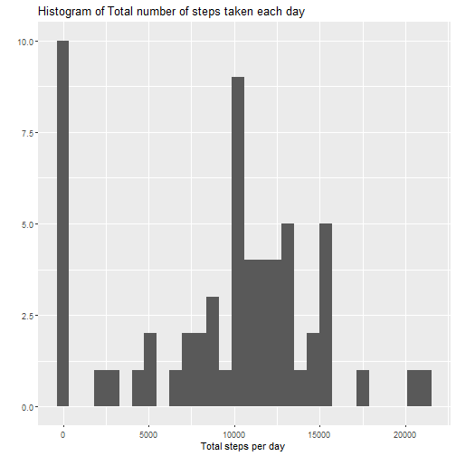
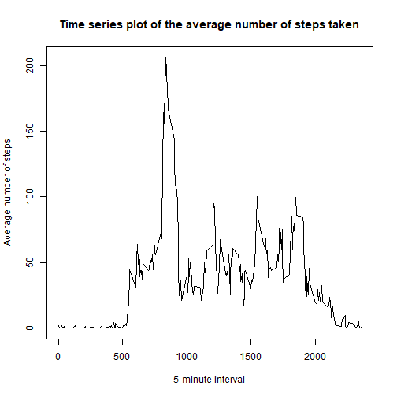
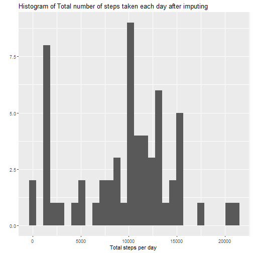
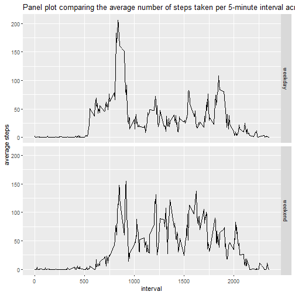

The dataset consists of data from a personal activity monitoring device. This device collects the number of steps at 5 minute intervals through out the day for two months.

The data for this assignment can be downloaded from the **activity.csv** file.

The variables in this dataset are:

- **steps**: Number of steps taking in a 5-minute interval (missing values are coded as 'NA')
- **date**: The date on which the measurement was taken in YYYY-MM-DD format
- **interval**: Identifier for the 5-minute interval in which measurement was taken
The dataset is stored in a comma-separated-value (CSV) file and there are a total of 17,568 observations in this dataset.

## Loading and preprocessing the data

The dataset is first read into a variable *"dataset"* using the read.csv function. The date variable was found to belong to the character class. Thus, it was changed to a Date variable using as.Date function. 

```r
## read the dataset
dataset <- read.csv("activity.csv")
dataset$date <- as.Date(dataset$date,"%Y-%m-%d")
```

## What is mean total number of steps taken per day?

To calculate the total number of steps taker per day, the group_by function is used from the library *dplyr*. The dataset is grouped based on the day and using the summarize function, the total steps taken in a particular day is calculated and the result in stored in *"total_steps_perday"*.

Using the ggplot plotting system, the histogram representing the total steps taken on per day basis is produced using the geom_histogram() function whch is in the *ggplot2* package.


```r
## Total number of steps in a day
library(dplyr)
x <- group_by(dataset,dataset$date)
total_steps_perday <- summarize(x,sum(steps,na.rm=TRUE))
names(total_steps_perday) <- c("date","total steps per day")
total_steps_perday
```

```
## # A tibble: 61 x 2
##    date       `total steps per day`
##    <date>                     <int>
##  1 2012-10-01                     0
##  2 2012-10-02                   126
##  3 2012-10-03                 11352
##  4 2012-10-04                 12116
##  5 2012-10-05                 13294
##  6 2012-10-06                 15420
##  7 2012-10-07                 11015
##  8 2012-10-08                     0
##  9 2012-10-09                 12811
## 10 2012-10-10                  9900
## # ... with 51 more rows
```


```r
## Histogram of the total number of steps taken each day
library(ggplot2)
qplot(`total steps per day`,data = total_steps_perday) + xlab("Total steps per day ") + ggtitle("Histogram of Total number of steps taken each day")
```

```
## `stat_bin()` using `bins = 30`. Pick better value with `binwidth`.
```



The mean of total number of steps per day is calculated by applying the mean function to the total steps per day variable in the *total_steps_perday* data frame and the result is in **mean_of_totalsteps**.(NAs are ignored)

The median of total number of steps per day is calculated by applying the median function to the total steps per day variable in the *total_steps_perday* data frame and the result is in **median_of_totalsteps**. (NAs are ignored)

**NOTE**:
- ceiling function is used as number of steps cannot be a decimal number.


```r
## Calculate the mean and median of the total number of steps taken per day
mean_of_totalsteps <- ceiling(mean(total_steps_perday$`total steps per day`))
print("MEAN OF TOTAL STEPS TAKEN PER DAY:")
```

```
## [1] "MEAN OF TOTAL STEPS TAKEN PER DAY:"
```

```r
mean_of_totalsteps
```

```
## [1] 9355
```

```r
median_of_totalsteps <- ceiling(median(total_steps_perday$`total steps per day`))
print("MEDIAN OF TOTAL STEPS TAKEN PER DAY:")
```

```
## [1] "MEDIAN OF TOTAL STEPS TAKEN PER DAY:"
```

```r
median_of_totalsteps
```

```
## [1] 10395
```

## What is the average daily activity pattern?

To find the average daily activity pattern, the dataset is first grouped by the interval variable and the mean of steps taken in each interval averaged across all days is available in the data frame, *"average_steps"*.

A time series plot is constructed using the plot function (base plotting system), where the 5-minute interval lies in the x-axis and the average number of steps taken, averaged across all days is in the y-axis. 


```r
y <- group_by(dataset,dataset$interval)
average_steps <- summarize(y,mean(steps,na.rm=TRUE))
names(average_steps)<- c("interval","average steps")
plot(average_steps$interval,average_steps$`average steps`,type="l",main="Time series plot of the average number of steps taken", xlab="5-minute interval",ylab="Average number of steps")
```



To calculate the 5-minute interval that, on average, contains the maximum number of steps, the *max* function is used, and the result is stored in **interval_max_steps**


```r
interval_max_steps <- average_steps[which.max(average_steps$`average steps`),]$interval
print("THE 5-MINUTE INTERVAL THAT CONTAINS MAXIMUM NO. OF STEPS:")
```

```
## [1] "THE 5-MINUTE INTERVAL THAT CONTAINS MAXIMUM NO. OF STEPS:"
```

```r
interval_max_steps
```

```
## [1] 835
```

## Imputing missing values

The total number of rows having NAs are calculated usin the is.na function.

```r
total_missing_values <- sum(is.na(dataset$steps))
print("TOTAL NO. OF ROWS HAVING MISSING DATA")
```

```
## [1] "TOTAL NO. OF ROWS HAVING MISSING DATA"
```

```r
total_missing_values
```

```
## [1] 2304
```

To impute the missing values, the strategy used is the median of steps taken for the particular 5-minute interval. Using the ifelse function, if a row contains a missing value, it is replaced by a median of steps taken in that 5-minute interval over all days using the **ave()** function and if it's not a missing value, the same value is retained. The complete dataset with no missing values, is stored in the **new_dataset** dataframe.


```r
new_dataset <- dataset
new_dataset$steps <- ifelse(is.na(new_dataset$steps), 
                            ave(new_dataset$steps,new_dataset$interval, FUN = function(x) median(x,na.rm=TRUE)), 
                            new_dataset$steps)
```

The new_dataset is grouped based on the day and using the summarize function, the total steps taken in a particular day is calculated and the result in stored in *"total_steps_perday_new"*.


```r
x1 <- group_by(new_dataset,new_dataset$date)
total_steps_perday_new <- summarize(x1,sum(steps,na.rm=TRUE))
names(total_steps_perday_new) <- c("date","total steps per day")
total_steps_perday_new
```

```
## # A tibble: 61 x 2
##    date       `total steps per day`
##    <date>                     <int>
##  1 2012-10-01                  1141
##  2 2012-10-02                   126
##  3 2012-10-03                 11352
##  4 2012-10-04                 12116
##  5 2012-10-05                 13294
##  6 2012-10-06                 15420
##  7 2012-10-07                 11015
##  8 2012-10-08                  1141
##  9 2012-10-09                 12811
## 10 2012-10-10                  9900
## # ... with 51 more rows
```


A histogram of the total number of steps taken each day is constructed from the new_dataset using the ggplot system.


```r
qplot(`total steps per day`,data = total_steps_perday_new) + xlab("Total steps per day ") + ggtitle("Histogram of Total number of steps taken each day after imputing")
```

```
## `stat_bin()` using `bins = 30`. Pick better value with `binwidth`.
```




The mean of total number of steps per day is calculated by applying the mean function to the total steps per day variable in the *total_steps_perday_new* data frame and the result is in **new_mean_of_totalsteps**.

The median of total number of steps per day is calculated by applying the median function to the total steps per day variable in the *total_steps_perday_new* data frame and the result is in **new_median_of_totalsteps**. 


```r
new_mean_of_totalsteps <- ceiling(mean(total_steps_perday_new$`total steps per day`))
print("MEAN OF TOTAL STEPS TAKEN PER DAY AFTER IMPUTING:")
```

```
## [1] "MEAN OF TOTAL STEPS TAKEN PER DAY AFTER IMPUTING:"
```

```r
new_mean_of_totalsteps
```

```
## [1] 9504
```

```r
new_median_of_totalsteps <- ceiling(median(total_steps_perday_new$`total steps per day`))
print("MEDIAN OF TOTAL STEPS TAKEN PER DAY AFTER IMPUTING:")
```

```
## [1] "MEDIAN OF TOTAL STEPS TAKEN PER DAY AFTER IMPUTING:"
```

```r
new_median_of_totalsteps
```

```
## [1] 10395
```

Do these values differ from the estimates from the part before imputing the missing values? 

```r
print("MEAN OF TOTAL STEPS TAKEN PER DAY BEFORE IMPUTING:")
```

```
## [1] "MEAN OF TOTAL STEPS TAKEN PER DAY BEFORE IMPUTING:"
```

```r
mean_of_totalsteps
```

```
## [1] 9355
```

```r
print("MEDIAN OF TOTAL STEPS TAKEN PER DAY BEFORE IMPUTING:")
```

```
## [1] "MEDIAN OF TOTAL STEPS TAKEN PER DAY BEFORE IMPUTING:"
```

```r
median_of_totalsteps
```

```
## [1] 10395
```
 
From the results, it is clear that the mean of total steps taken each day has increased significantly. The median remains the same as the median is used as the startegy for imputing the dataset.

Total numbers of steps each day after imputing has increased after imputing the missing values.

## Are there differences in activity patterns between weekdays and weekends?

**weekdays()** function is used to create a varible that indicates whether a particular date is a weekday or a weekend. Using the *mutate* function, a factor variable "day" is added to the new_dataset.

A panel plot containing a time series plot of the 5-minute interval (x-axis) and the average number of steps taken, averaged across all weekday days or weekend days (y-axis) is created using ggplot system. 


```r
new_dataset <- mutate(new_dataset, day = ifelse(weekdays(new_dataset$date)=="Sunday" | weekdays(new_dataset$date)=="Saturday","weekend","weekday"))
y1 <- group_by(new_dataset,new_dataset$day,new_dataset$interval)
average_steps_new <- summarize(y1,mean(steps,na.rm=TRUE))
names(average_steps_new)<- c("day","interval","average steps")
ggplot(data = average_steps_new,aes(interval,`average steps`)) + geom_line() + facet_grid(day~.) + ggtitle("Panel plot comparing the average number of steps taken per 5-minute interval across weekdays and weekends")
```



It is evident from the plot that there exists variation in pattern when comparing weekend and weekday data. During Weekends, the steps taken is higher. During Weekdays, a peak is observed initially and eventually decreases.
